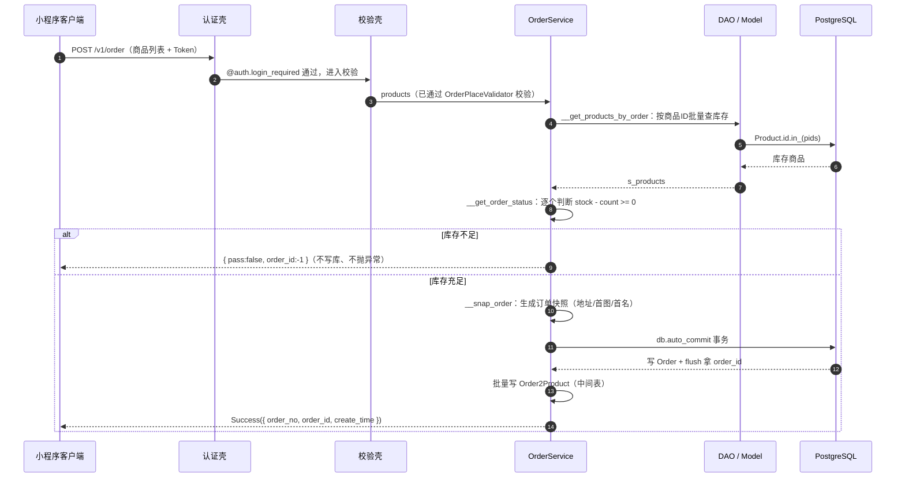

# 实战拆解 · 下单流程

把前面学的所有层串起来，看整个项目最复杂的业务——**下单**。能看懂下单，就全通了。

## 入口：api/v1/order.py 的 place_order

查看它从接口层一路执行到数据库的流程：

```python
# 下单接口 + 完整装饰器壳（app/api/v1/order.py）
@api.route('', methods=['POST'])
@api.doc(auth=True)                              # 自动生成文档
@auth.login_required                            # 认证：没登录不能下单
def place_order():
    '''提交订单'''
    # ① 校验请求体里的商品列表（product_id + count）
    products = OrderPlaceValidator().validate_for_api().products.data
    # ② 交给业务层处理（核心下单逻辑）
    status = OrderService().palce(uid=g.user.id, o_products=products)
    return Success(status)                        # ③ 统一返回
```

## 业务层进入：service/order.py 的 OrderService

这是全项目的业务难点。`palce` 的完整流程是**「先校验库存，通过才生成订单」**：

```python
class OrderService:
    def palce(self, uid, o_products):          # 下单方法
        self.o_products = o_products
        # ① 按商品ID批量查库存（dao → models）
        self.s_products = self.__get_products_by_order(o_products)
        self.uid = uid
        # ② 校验库存（遍历每个商品，判断 stock - count >= 0）
        status = self.__get_order_status()
        if not status['pass']:                 # 库存不足 → 不抛异常，标记失败返回
            status['order_id'] = -1
            return status
        # ③ 库存通过，生成订单快照（地址/首图/首名，快照不可变）
        order_snap = self.__snap_order(status)
        # ④ 把订单 + 商品中间表写入数据库（db.auto_commit 事务）
        order = self.__create_order(order_snap)
        order['pass'] = True
        return order
```

::: warning 与「把库存扣掉」的直觉不同
真实的 `palce` **只校验库存，并不扣减库存**。它把订单和商品快照存了下来，真正的库存扣减发生在**支付成功之后**（见 `service/pay.py`）。

很多新手会误以为下单时库存就已扣减——这里明确一下：下单阶段只「检查库存 + 记录订单」，不动库存数据。
:::

## 对应流程图



::: tip 本节考点
你能看出下单流程里，`service`（业务）、`dao`（查库）、`models`（表结构）三个层各干了什么事吗？能分清，就算真把分层学通了。

真实流程里还有两个应记的细节：
- **库存校验失败不抛异常**，而是返回 `pass:false` 让接口层优雅处理；
- **订单和商品通过 `Order2Product` 中间表关联**，且用的是 `db.auto_commit()` 的同一事务写入。
:::

下一步：[动手·添加新接口](/guide/practice)